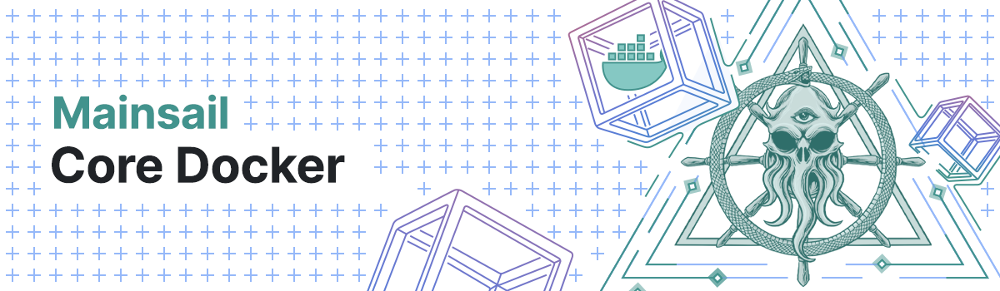

# Mainsail Docker Build Environment

<p align="center">
    
</p>

## Introduction

A full Mainsail build environment in a container. No need to install anything locally. It bind mounts your local Mainsail folder as a volume in the container. Just run the container, enter it, build Mainsail and run it. 

## Docker Compose  

Run the build environment using [Docker Compose](https://docs.docker.com/compose/)

## Mainsail Build Environment  

> [!NOTE]
> Please pay attention to the following option in your [`build.env`](./build.env) file!

|`API=false`| Set `API=true` if you intend to run an API server |
|-----------|:--------------------------------------------------|


> _Start_:

```bash
docker-compose --env-file build.env up -d
```

> [!NOTE]
> That will start a Mainsail Build Environment container and a PostgreSQL server container by exposing it's TCP port to `localhost:5454` on your local machine (that's made to avoid conflicts with default ports in case you already have a local PostgreSQL instance running.  If you intend to use your local PostgreSQL server instead change the DB settings in your [`build.env`](./build.env) file by settng `MAINSAIL_DB_HOST=host-gateway` and the rest of the DB credentials as you have created them. You'll have to also allow connections to the the local DB from the Docker network block (usually 192.168.0.0/16 and 172.16.0.0/12).

> In case you don't want to run a PostgreSQL instance at all, you can ommit starting by:

```bash
docker-compose --env-file build.env up -d core
```

> _Build Mainsail_:

```bash
docker exec -it mainsail-build bash
```

```bash
cd ~/mainsail
pnpm run setup
```

> _Run Local Devnet with 53 validators_:

> On another console or new shell instance

```bash
docker exec -it mainsail-build bash
```

```bash
cd ~/mainsail/packages/core
pnpm run full:devnet
```

> _Run API server_:

> On another console or new shell instance

```bash
docker exec -it mainsail-build bash
```

```bash
cd ~/mainsail/packages/api
pnpm run api:devnet
```

> _Stop and remove_:

```bash
docker-compose down --remove-orphans -v --rmi all 
```
